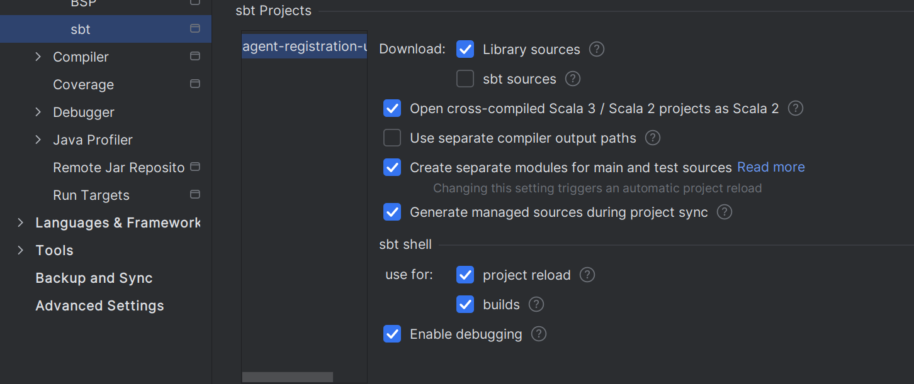

# agent-registration-ui-tests

This repository contains UI tests for agent registration service. The tests require services to be running and
use Selenium WebDriver to interact with the UI elements.

## Pre-requisites

### Mongo

Start the Mongo Docker container if it's not already running:

```bash
docker run --rm -d -p 27017:27017 --name mongo percona/percona-server-mongodb:6.0
```

### Agent Registration Services

Start `AGENT_REGISTRATION_ALL` services:

```bash
sm2 --start AGENT_REGISTRATION_ALL
```

## Running tests

### From command line 

To run tests in batch mode, use `run-tests.sh`. The script accepts parameters to adjust the run as needed. See its
contents for details.
This is how the tests are run from CI (Jenkins).

```bash
./run-tests.sh
```

### From intellij IDEA

Use built-in run configurations to run individual scenarios, see below screenshot for guidance:


Ensure the project is imported into IntelliJ correctly, see below screenshot for guidance



## License

This code is open source software licensed under the [Apache 2.0 License]("http://www.apache.org/licenses/LICENSE-2.0.html").
